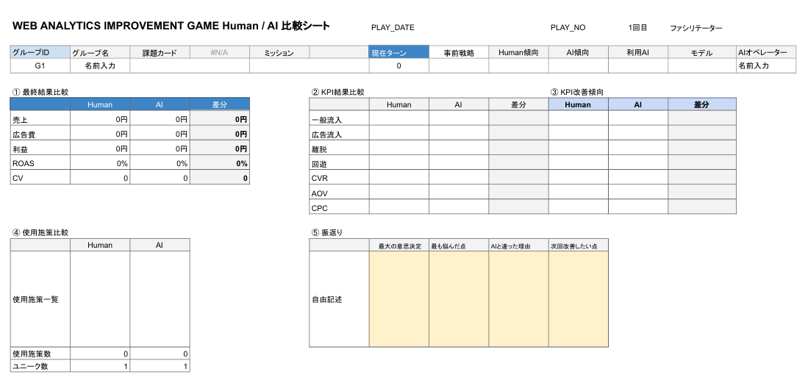

# WEB ANALYTICS IMPROVEMENT GAME  
## AI比較・活用型 実践シミュレーション

> 「施策を知っている」から、  
> 「意思決定できる」へ。

---

# 概要

WEB ANALYTICS IMPROVEMENT GAME（WAIG）は、  
Webサイト改善・マーケティング施策・DX推進における  
**意思決定力を実践形式で学ぶためのシミュレーションゲーム**です。

参加者は限られたリソースの中で施策を選択し、  
KPIを改善しながら売上最大化を目指します。

本ゲームの最大の特徴は、  
**AIと人間の意思決定を比較できること**です。

---

# このゲームで学べること

- KPIの構造理解
- 施策の因果関係
- 優先順位の考え方
- 限られた予算内での判断
- 市場環境変化への対応
- チームでの意思決定
- AI活用と人間判断の違い
- 「なぜその施策を選んだのか」の言語化

---

# このゲームの特徴

## 1. 実務型シミュレーション

単なる知識クイズではありません。

実際のWeb改善現場に近い形で、

- SEO
- SNS
- 広告
- LP改善
- CRM
- UI改善
- リピート施策

などを組み合わせ、成果を競います。

---

## 2. AI比較型トレーニング

本ゲームでは、

- 人間チーム
- AIオペレーター

を比較できます。

AIの提案を「答え」として扱うのではなく、

- AIはなぜその提案をしたのか
- 人間はなぜ違う判断をしたのか
- どちらが成果につながったのか

を比較・分析することで、  
実践的なAI活用力を養います。

---

## 3. KPI構造を体感できる

本ゲームでは、施策によって以下のKPIが変動します。

| KPI | 内容 |
|---|---|
| General Inflow | 自然流入・SNS・口コミ等 |
| Ad Inflow | 広告流入 |
| Bounce | 離脱率 |
| Browse | 回遊率 |
| CVR | コンバージョン率 |
| AOV | 客単価 |
| CPC | 広告クリック単価 |

プレイヤーは数値変化を見ながら、  
「どの施策が、どのKPIに影響したか」を理解していきます。

---

# カード構成

## 課題カード（Challenge）

改善対象となる状況設定です。

例：

- EC売上低迷
- 広告依存
- CVR悪化
- リピート率低下
- 地方店舗DX
- 採用難
- 行政DX推進

など。

---

## ミッションカード（Mission）

プレイヤーが達成すべき目標です。

例：

- 売上150％達成
- 広告費削減
- CVR改善
- リピート率向上

など。

---

## 施策カード（Action）

具体的な改善施策です。

例：

- SEO強化
- SNS運用
- LP改善
- CRM導入
- UI改善
- 広告最適化

など。

各カードには、

- コスト
- KPI変動
- 副作用
- 相乗効果

が設定されています。

---

## トレンドカード（Trend）

市場環境変化を表します。

例：

- 市場成長
- CPC高騰
- SNSブーム
- 不況
- 季節需要

など。

---

## 3Cカード

外部環境要因です。

- Customer
- Competitor
- Company

の視点から、  
市場変化をシミュレーションします。

---

## スキルカード（Skill）

チーム特性・強みを表します。

例：

- 分析力
- SNS運用力
- CRM知識
- UI設計力
- 広告運用力

など。

ターン経過で効果を発揮するものもあります。

---

# ゲームの流れ

| フェーズ | 内容 |
|---|---|
| 1 | 課題カード選択 |
| 2 | ミッション決定 |
| 3 | スキルカード設定 |
| 4 | 初期KPI確認 |
| 5 | 施策選択 |
| 6 | KPI変動計算 |
| 7 | 市場変化適用 |
| 8 | AIとの比較 |
| 9 | 振り返り |

---

# AI比較の考え方

このゲームで重要なのは、  
AIの「正解」を学ぶことではありません。

重要なのは、

- AIはどの情報を重視したか
- 人間は何を優先したか
- 判断の根拠は何か
- なぜ差が生まれたか

を分析することです。

つまり、

> 「AIを使う力」ではなく、  
> 「AIと比較しながら考える力」

を育てるゲームです。

---

# 活用シーン

## 研修

- Webマーケティング研修
- DX研修
- データ分析研修
- 管理職研修
- 行政DX研修

---

## 資格講座

- ウェブ解析士講座
- マスター講座
- 社内教育

---

## チームビルディング

- グループワーク
- 戦略立案演習
- ディスカッション研修

---

# 対応形式

| 形式 | 対応 |
|---|---|
| リアル研修 | ○ |
| オンライン研修 | ○ |
| 個人学習 | ○ |
| AI活用演習 | ○ |

---

# 提供データ

本プロジェクトには以下が含まれます。

- ルールブック
- ファシリテーターガイド
- カードデータ（MD）
- HTMLカード
- スプレッドシート管理シート
- AI比較シート
- KPI計算シート

---

# カスタマイズ

本ゲームは拡張可能です。

## 対応可能分野例

- EC
- 美容院
- 歯科医院
- 学校
- 行政
- 地方創生
- DX推進
- BtoB
- SaaS
- 採用マーケティング

---

# 推奨環境

- Google スプレッドシート
- GitHub
- NotebookLM
- ChatGPT
- Claude
- Gemini

---

# ライセンス

MIT License

商用・非商用を問わず、  
自由に利用・改変可能です。

---

# Credit

Developed by KozyWorks

Decision Training & Web Analytics Learning Project

---

# 関連サイト

- https://www.kameikoji.jp/
- https://kozyworks.jp/
- https://kozyworks.jp/decision-training/

---

# 最新リリース

## Current Stable Release

- v2.0.0

このバージョンでは、

- スプレッドシート構造
- KPI計算ロジック
- compare_db
- AI比較ワークフロー

を大幅に更新しています。

## 重要

v2.0.0 は v1 テンプレートと互換性がありません。

最新テンプレートを使用してください。

参照：

- /release/v2_0_0/
- /release/v2_0_0/google_drive_template.md
- CHANGELOG.md

---

# メッセージ

知識だけでは、意思決定はできません。

重要なのは、

- 状況を理解し
- 優先順位を決め
- 不確実性の中で判断し
- 振り返ること

です。

このゲームが、  
その実践体験の場になることを願っています。
